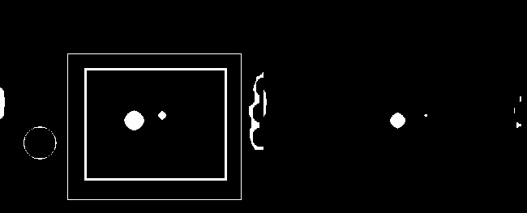
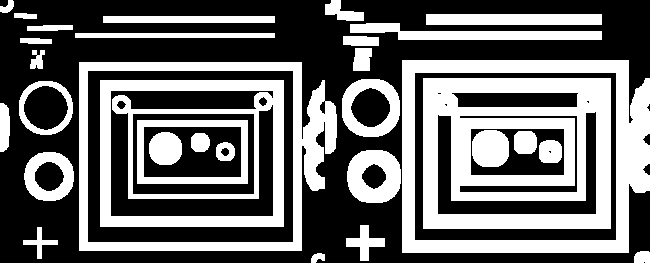

# 形态学操作

## 腐蚀操作

原理： 腐蚀会“收缩”前景（通常是白色区域）。

对于每个像素：

- 只有当 kernel 覆盖区域内的像素全部为前景时，该像素才会保留为前景。 否则变为背景。

可以理解为： **取局部最小值（min filter）**

```python
erosion = cv2.erode(src, kernel, iterations)
```

- 输入
	- `src`：原始输入图像
	- `kernel`：结构元素（structuring element），本质是一个卷积核，用于定义腐蚀的范围和形状
	- `iterations`：腐蚀执行的次数
		- 次数越多，前景区域越小
- 输出
	- `erosion`：腐蚀操作后的图像（ndarray）



## 膨胀操作

膨胀会“扩张”前景（通常是白色区域）。

对于每个像素：

- 只要 kernel 覆盖区域内存在前景像素，该像素就会被设为前景。否则保持为背景。

可以理解为： **取局部最大值（max filter）**

```python
dilate = cv2.dilate(src, kernel, iterations)
```

- 输入
	- `src`：原始输入图像
	- `kernel`：结构元素（structuring element），本质是一个卷积核，用于定义膨胀的范围和形状。
	- `iterations`：腐蚀执行的次数
		- 次数越多，前景区域越大
- 输出
	- `dilate`：膨胀操作后的图像（ndarray）



## 开运算与闭运算

- 开运算：先腐蚀再膨胀
- 闭运算：先膨胀再腐蚀

```python
dst = cv2.morphologyEx(src, op, kernel)
```

- 输入
	- `src`：原始输入图像
	- `op`:形态学操作类型，常用的有：
		- `cv2.MORPH_OPEN` : 开运算
		- `cv2.MORPH_CLOSE`: 闭运算
	- `kernel`：结构元素（structuring element），本质是一个卷积核，用于定义形态学操作的作用范围和形状。
- 输出
	- `dst`：形态学操作后的图像（ndarray）

常用于：

- 开运算
	- 去除小的白色噪声
	- 断开细小连接
	- 保持整体形状不被明显放大
	- **平滑前景边界，并删除小目标**
- 闭运算
	- 填补前景中的小孔洞
	- 连接相邻目标
	- 让边界更加连续
	- **修复前景结构**

## 梯度运算

原理：膨胀-腐蚀，用于突出物体的边界，从而获得目标轮廓

```python
gradient = cv2.morphologyEx(src, cv2.MORPH_GRADIENT, kernel)
```

- 输入
	- `src`：原始输入图像
	- `op`:形态学操作类型，常用的有：
		- `cv2.MORPH_GRADIENT` : 形态学梯度
	- `kernel`：结构元素（structuring element），本质是一个卷积核，用于定义膨胀的范围和形状。
		- 轮廓越粗
		- 细节越少
- 输出
	- `dst`：形态学操作后的图像（ndarray）

常用于：

- 提取目标轮廓
- 边界检测
- 图像分割前的预处理
- 强化结构信息

## 顶帽与黑帽

- 顶帽：原图像-开运算
	- 用于提取 比 kernel 小的亮区域。
- 黑帽：闭运算-原图像
	- 用于提取 比 kernel 小的暗区域。

```python
dst = cv2.morphologyEx(src, op, kernel)
```

- 输入
	- `src`：原始输入图像
	- `op`:形态学操作类型，常用的有：
		- `cv2.MORPH_TOHAT` : 顶帽
		- `cv2.MORPH_BLACKHAT`: 黑帽
	- `kernel`：结构元素（structuring element），本质是一个卷积核，用于定义形态学操作的作用范围和形状。
- 输出
	- `dst`：形态学操作后的图像（ndarray）

常用于：

- 顶帽
	- 检测小亮点
	- 增强文字
	- 处理光照不均
	- 医学图像增强
- 黑帽
	- 检测暗斑 / 裂纹
	- 强化黑色细节
	- 背景校正

# 比较

## 综合

| 操作            | 数学表达     | 作用     | 典型用途        | 记忆口诀 |
|---------------|----------|--------|-------------|------|
| **腐蚀**        | 局部最小值    | 收缩前景   | 去白噪声、断开连接   | 白变小  |
| **膨胀**        | 局部最大值    | 扩张前景   | 填孔、连接目标     | 白变大  |
| **开运算**       | 腐蚀 → 膨胀  | 删除小白点  | 去噪          | 去小白  |
| **闭运算**       | 膨胀 → 腐蚀  | 填补黑洞   | 修复结构        | 填小黑  |
| **梯度**        | 膨胀 − 腐蚀  | 提取边界   | 轮廓检测        | 找边   |
| **Top Hat**   | 原图 − 开运算 | 提取小亮区域 | 文字增强 / 光照校正 | 找小白  |
| **Black Hat** | 闭运算 − 原图 | 提取小暗区域 | 裂纹检测        | 找小黑  |

## 二值形态学 vs 灰度形态学

| 维度         | 二值形态学（Binary Morphology） | 灰度形态学（Grayscale Morphology） |
|------------|--------------------------|-----------------------------|
| **像素范围**   | 只有 `0 / 255`             | `0–255` 连续灰度                |
| **核心目标**   | 改变几何结构                   | 强化局部对比                      |
| **关注重点**   | 形状                       | 强度变化                        |
| **视觉效果**   | 结果非常“干净”                 | 结果更自然                       |
| **是否依赖阈值** | ✅ 强依赖                    | ❌ 通常不需要                     |
| **对噪声敏感度** | 较高（阈值选错会炸）               | 更稳健                         |
| **信息保留**   | 容易丢失细节                   | 保留更多结构信息                    |

## 更适合二值图的操作

| 操作           | 为什么适合      |
|--------------|------------|
| **Erosion**  | 直接删除白色像素   |
| **Dilation** | 明确扩张目标     |
| **Opening**  | 去除小白噪声非常高效 |
| **Closing**  | 填补孔洞效果极好   |

**本质： 对“形状”动手术。**

常见场景：

- 连通域分析
- 目标计数
- 轮廓提取前清理
- OCR 预处理

## 更适合灰度图的操作

| 操作            | 为什么适合    |
|---------------|----------|
| **Top Hat**   | 提升亮区域对比度 |
| **Black Hat** | 强化暗结构    |
| **Gradient**  | 提取结构边界   |

**本质： 对“对比度”动手术。**

常见场景：

- 光照不均校正
- 文字增强
- 医学影像
- 工业缺陷检测